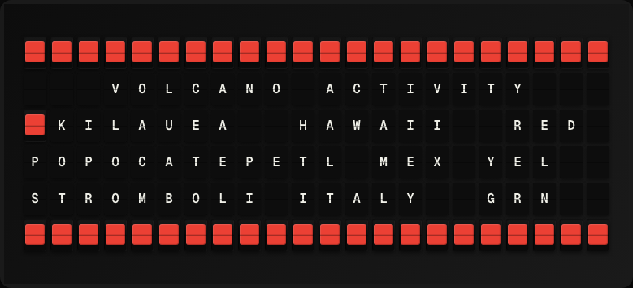

# Volcano Activity Plugin

Display current volcanic eruption alerts from the Smithsonian Global Volcanism Program weekly report.



**→ [Setup Guide](./docs/SETUP.md)**

## Overview

The Volcano Activity plugin reads the Smithsonian GVP [Weekly Volcanic Activity Report](https://volcano.si.edu/) RSS feed and shows the volcano at the top of it, along with how many are listed as active that week. The GVP lists new activity and unrest ahead of ongoing activity, so the first entry is the week's most notable volcano.

No API key is required, and no third-party packages are needed — the feed is fetched with `requests` and parsed with `defusedxml`, both of which FiestaBoard already ships.

## Template Variables

| Variable | Description | Example |
|---|---|---|
| `volcano.volcano_name` | Volcano at the top of this week's report | `Asosan` |
| `volcano.country` | Country that volcano is in | `Japan` |
| `volcano.activity` | Activity status from the report | `New Unrest` |
| `volcano.active_count` | Number of volcanoes listed as active this week | `21` |

### Activity values

The GVP's status wording is wider than a board line — `Continuing Eruptive Activity` is 28 characters against a 22-tile Flagship row — so the four statuses it uses are shortened:

| GVP status | `volcano.activity` |
|---|---|
| New Unrest | `New Unrest` |
| Continuing Unrest | `Ongoing Unrest` |
| New Eruptive Activity | `New Eruption` |
| Continuing Eruptive Activity | `Ongoing Eruption` |

Any status not in this table is passed through unchanged.

## Example Templates

```
VOLCANO ACTIVITY
{{volcano.volcano_name}}
{{volcano.country}}
{{volcano.activity}}
Active this week: {{volcano.active_count}}

```

## Configuration

| Setting | Name | Description | Required |
|---|---|---|---|
| `refresh_seconds` | Refresh Interval | How often to fetch data (seconds) | No |

The report is published weekly, so there is nothing to gain from refreshing faster than the 1800s minimum.

## Features

- Smithsonian GVP weekly activity report
- Volcano name, country, and activity status
- Active volcano count
- No API key required
- No dependencies beyond what FiestaBoard ships

## Author

FiestaBoard Team
